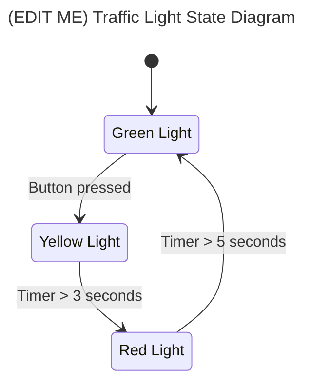

# Assignment 1: Traffic Light

The first step is to implement the traffic light cycling from green, to yellow, then to red.

## Requirements
The traffic light starts with only the green light illuminated. When the crosswalk button is pressed (goes low), the light immediately switches to yellow. Three seconds later, the light turns red. Five seconds after the light turns red, the light resets to green.

## State Machine

The provided starter code only cycles between green and red. We need to add in another state for the yellow light. Modify the state diagram below to add in the appropriate state and transitions. Make sure to include the conditions for when transitions happen. See the [Mermaid diagramming language docs](https://mermaid.js.org/syntax/stateDiagram.html) for more details on the syntax.

## Implementation

Next, modify the code in `TrafficLightSystem.java` to implement your state machine. Run the code in the simulator and verify that the timings are working as expected. When your implementation is working in simulator, demonstrate your code to a mentor on the test board to complete this assignment.