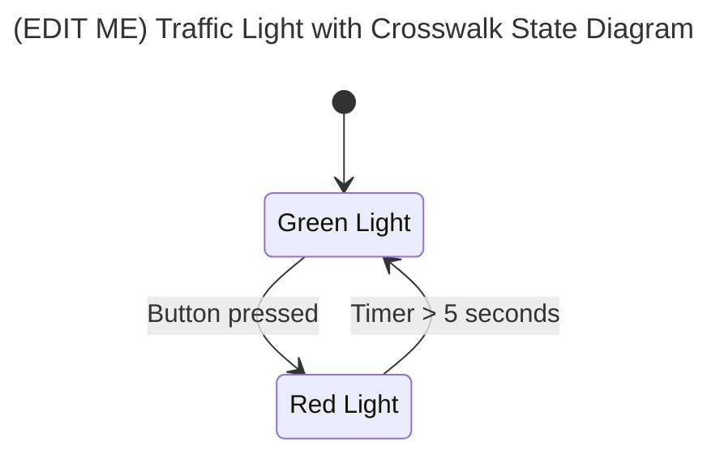

# Assignment 2: Crosswalk Signal

Now that we have the main traffic light cycling, it is time to implement the crosswalk walk/don't walk sign.

## Requirements
* If the main traffic light is yellow or green, the "don't walk" sign must remain lit with an orange light and the "walk" sign must be dark. 
* After the main traffic light turns red, turn off the "don't walk" sign and immediately light up the "walk" sign with a white light for three seconds. Then turn off the "walk" sign and start flashing the orange "don't walk" sign every second for the next eight seconds.
* After these eight seconds, the main traffic light turns green.

See the [Caltrans Manual on Uniform Traffic Control Devices](https://dot.ca.gov/programs/safety-programs/camutcd), Part 4 Section 4E.06: "Pedestrian Intervals and Signal Phases" if you want to see the full requirements for an actual traffic light.

## State Machine

Copy in your the state diagram from Exercise 1, then add in the appropriate states and transitions to implement the crosswalk signal. Make sure to include the conditions for when transitions happen, and annotate what lights should be on/off in each state. See the [Mermaid diagramming language docs](https://mermaid.js.org/syntax/stateDiagram.html) for more details on the syntax.

## Implementation

Next, modify the code in `TrafficLightSystem.java` to implement your state machine. Run the code in the simulator and verify that the timings are working as expected. When your implementation is working in simulator, demonstrate your code to a mentor on the test board to complete this assignment.