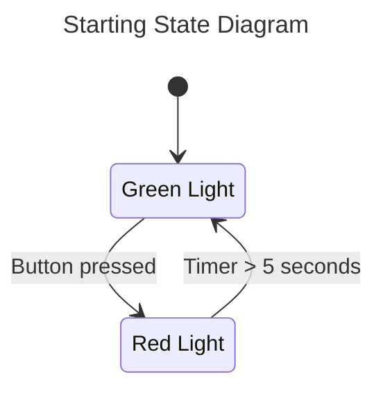

# Training: State Machines

In this exercise, we will build a more complex state machine to operate a traffic light. To access this lesson, clone this project using git:
`git clone https://github.com/Tino-FRC-2473/Training-StateMachines.git`

After this lesson you should known how to:
* Design a complex state machine
* Use [Timer](https://github.wpilib.org/allwpilib/docs/release/java/edu/wpi/first/wpilibj/Timer.html) to track time
* Read switches with [DigitalInput](https://github.wpilib.org/allwpilib/docs/release/java/edu/wpi/first/wpilibj/DigitalInput.html)
* Control LED strips with [AddressableLED](https://github.wpilib.org/allwpilib/docs/release/java/edu/wpi/first/wpilibj/AddressableLED.html) and [AddressableLEDBuffer](https://github.wpilib.org/allwpilib/docs/release/java/edu/wpi/first/wpilibj/AddressableLEDBuffer.html)
* Post debug information to [SmartDashboard](https://docs.wpilib.org/en/stable/docs/software/dashboards/smartdashboard/displaying-expressions.html) and view it with [AdvantageScope](https://docs.wpilib.org/en/stable/docs/software/dashboards/advantagescope.html).

## Introduction

The goal of this exercise is to create a basic traffic light including a crosswalk signal. When a button is pressed, the traffic light will cycle from green, to yellow, then to red with correct timings. Then, the walk sign and raised hand will illuminate and flash while the crosswalk is active.

Some skeleton code has been written for you in `TrafficLightSystem.java`. Right now only two states are implemented, one representing a red light and one representing a green light. When the button is pressed, the light switches to red for five seconds before reverting to green light.

> [!NOTE]
> If the state diagram is not showing up for you, install the [Markdown Preview Mermaid Support](https://marketplace.visualstudio.com/items?itemName=bierner.markdown-mermaid) extension in VSCode.

## Hardware Definition

The hardware definitions have already been completed for you in `HardwareMap.java`. Notice that we have a button connected to a digital input that will represent the crosswalk request button. This is a normally open button, so the input will read high (true) when the button is not preseed, and low (false) when the button is pressed. All of the lights in the traffic light are wired as a signal addressable LED strip. The LED strip is controlled from a PWM port on the RoboRIO. Please open up `HardwareMap.java` and verify your button and addressable LED strip connections match the values defined in our code.

## Simulation

After cloning the repo, open the project in VSCode and run the "WPILib: Simulate Robot Code" command to build and run the project in the robot simulator. Select "Sim GUI" and hit OK to start the simulation.

You should see the Simulation GUI appear. Under the "Hardware" menu, make sure the "Addressable LED" and "DIO" panels are open. These will let you see the state of the LED's and simulate a button press in the simulator.

Switch the "Robot State" to "Teleoperated" to start running the teleop code. You should see the green light turn on in the Addressable LED panel. Next, click on the dropdown in the DIO panel to change the state of the input to `0 (low)` briefly, before switching it back to `1 (high)`. This simulates presing the button. Notice how the addressable LED light immediately switches to red. Make sure you un-press the button by switching the input back to `1 (high)`. Five seconds after the button was pressed, you should see the LED change back to green.

## Debugging with SmartDashboard and AdvantageScope

You may have noticed that the `update()` function for the `TrafficLightSystem` includes some calls to SmartDashboard. [SmartDashboard](https://docs.wpilib.org/en/stable/docs/software/dashboards/smartdashboard/displaying-expressions.html) is a simple way to publish values from your code that can be displayed on the driver station for much easier debugging than sprinkling `println()` calls across your code.

SmartDashboard provides a set of API like `putString`, `putBoolean`, and `putNumber` that each take in a String key to label the value with and the value to save to the log. You can see in the `update()` function we are currently logging the current state of the `TrafficLightSystem`, the value of the button, and the internal timer value.

Let's see this in action. [AdvantageScope](https://docs.wpilib.org/en/stable/docs/software/dashboards/advantagescope.html) is the new debugging dashboard provided as part of WPILib. You can open it by running `WPILib: Start Tool` from the command pallete in VSCode, then selecting `AdvantageScope`. In AdvantageScope, select File->Connect to Simulator, then launch the simulator from VSCode.

Once the simulation has started, you should see a set of values appear in the left sidebar of the AdvantageScope window. Under SmartDashboard, you should be able to see the values we published from our `update()` function. Drag the string and boolean values from the left sidebar into the "Discrete Fields" section of the graph. Drag the numeric timer value into the "Left Axis" section.

Next, switch the simulation to teleop and press the button a few times. Notice how in AdvantageScope we can see the values update in real time, as well as the internal state of our `TrafficLightSystem`. Try using double click in the timeline view to measure how long we are staying in `RED_LIGHT_STATE`.

AdvantageScope and SmartDashboard provide a very powerful way to visualize the robot's behavior in real time.

> [!WARNING]
> For this exercise, let's only use SmartDashboard for debugging. Do not add any `println` in your code.